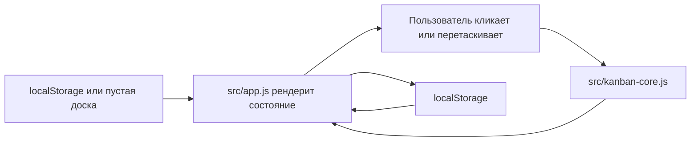

# Архитектура

## Обзор

Это статическое браузерное приложение. В нем нет backend, сборщика и runtime-зависимостей. Первый экран является рабочей доской: commandbar, компактный ассистент, строка выбранной карточки и канбан-колонки на всю ширину.

## Файлы

- `index.html`: HTML-оболочка.
- `src/app.js`: рендеринг DOM, обработка событий, drag/drop, сохранение в localStorage.
- `src/kanban-core.js`: чистая доменная логика доски, скоринг, перемещение, разделение, архив, восстановление и сводка.
- `src/styles.css`: визуальная система, адаптивная раскладка, motion и стили состояний.
- `tests/kanban-core.test.mjs`: тесты доменной логики через Node test runner.

## Поток данных

## Состояние

Приложение хранит карточки, выбранную карточку, текущую дату расчета и режим фокуса в `localStorage` под ключом `kanban-flow-board-state-v1`. Новый пользователь начинает с пустой доски; карточки появляются только после ручного создания. Архивирование ставит карточке `archivedAt`, а восстановление удаляет `archivedAt` и возвращает карточку в прежнюю колонку.

Карточка хранит две временные оси:

- `enteredAt`: вход в текущую колонку, нужен для поиска зависания в конкретной стадии.
- `startedAt` / `finishedAt`: вход и выход из рабочего потока, нужны для SLE-возраста и будущего расчета фактического cycle time.

## Скоринг

Коэффициенты Ассистента фокуса хранятся в `SCORING_RULES` в `src/kanban-core.js`. UI-подсказка рядом с `Ассистент фокуса` рендерит формулу из этих же правил, чтобы видимое объяснение совпадало с расчетом `scoreCard`.

Скоринг использует стартовую SLE-политику по размеру: S = 2 дня, M = 4 дня, L = 7 дней. Оценка нормализует возраст потока через `возраст / SLE`, добавляет бонусы за приближение к SLE, а затем учитывает стадию, приоритет, срок, размер, блокировку, WIP-перегруз и зависание в колонке. Обоснование модели лежит в `docs/research/focus-scoring-model.md`.

## Проверка

Доменная логика отделена от DOM, поэтому она проверяется командой `node --test`.
