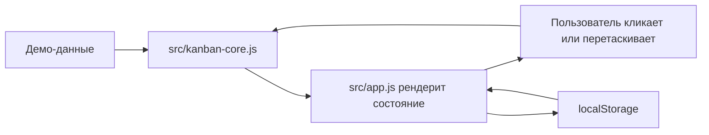

# Архитектура

## Обзор

Это статическая браузерная демка. В ней нет backend, сборщика и runtime-зависимостей.

## Файлы

- `index.html`: HTML-оболочка.
- `src/app.js`: рендеринг DOM, обработка событий, drag/drop, сохранение в localStorage.
- `src/kanban-core.js`: чистая доменная логика доски, скоринг, перемещение, разделение, архив и сводка.
- `src/styles.css`: визуальная система, адаптивная раскладка, motion и стили состояний.
- `tests/kanban-core.test.mjs`: тесты доменной логики через Node test runner.

## Поток данных

## Состояние

Приложение хранит карточки, выбранную карточку, текущую демо-дату и режим фокуса в `localStorage` под ключом `kanban-aging-demo-state-v2-ru`.

## Проверка

Доменная логика отделена от DOM, поэтому она проверяется командой `node --test`.
